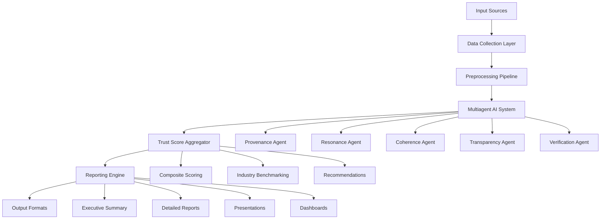

# AI Trust Stack - Technical Architecture

## System Overview

The AI Trust Stack is built as a microservices-based platform with a multiagent AI architecture for comprehensive trust analysis across five dimensions.

## Core Architecture Components

### 1. Data Collection Layer

```python
# Example data collection service structure
class DataCollector:
    def __init__(self):
        self.crawlers = {
            'web': WebCrawler(),
            'social': SocialMediaAPI(),
            'mobile': AppStoreAPI(),
            'private': PrivateDataConnector()
        }
    
    async def collect_content(self, target_url, content_types):
        """Collect content from multiple sources"""
        results = {}
        for content_type in content_types:
            crawler = self.crawlers.get(content_type)
            if crawler:
                results[content_type] = await crawler.fetch(target_url)
        return results
```

**Components:**
- **Web Crawler**: Scrapes websites, product pages, brand content
- **Social Media APIs**: Twitter, LinkedIn, Facebook, Instagram
- **Mobile App Analysis**: App Store, Google Play reviews
- **Private Data Connector**: CMS, internal databases (authenticated)

### 2. Preprocessing Pipeline

```python
class ContentPreprocessor:
    def __init__(self):
        self.normalizers = {
            'text': TextNormalizer(),
            'image': ImageProcessor(),
            'video': VideoAnalyzer(),
            'metadata': MetadataExtractor()
        }
    
    def preprocess(self, raw_content):
        """Normalize and tag content for AI analysis"""
        processed = {}
        for content_type, content in raw_content.items():
            normalizer = self.normalizers.get(content_type)
            if normalizer:
                processed[content_type] = normalizer.process(content)
        return processed
```

**Features:**
- Content type detection and tagging
- Language identification and translation
- Metadata extraction (author, date, source)
- Quality assessment and filtering

### 3. Multiagent AI System

#### Agent Base Class
```python
class TrustAgent:
    def __init__(self, model_name, dimension):
        self.model = self.load_model(model_name)
        self.dimension = dimension
        self.analysis_tools = self.setup_tools()
    
    async def analyze(self, content):
        """Analyze content for specific trust dimension"""
        processed_content = self.preprocess(content)
        analysis = await self.model.analyze(processed_content)
        return self.format_results(analysis)
    
    def setup_tools(self):
        """Setup specialized tools for this trust dimension"""
        pass
```

#### Specialized Agents

**Provenance Agent**
```python
class ProvenanceAgent(TrustAgent):
    def setup_tools(self):
        return {
            'authorship_detector': AuthorshipDetector(),
            'source_verifier': SourceVerifier(),
            'ai_disclosure_checker': AIDisclosureChecker(),
            'brand_identity_analyzer': BrandIdentityAnalyzer()
        }
    
    async def analyze(self, content):
        results = {
            'authorship_clarity': await self.authorship_detector.detect(content),
            'ai_disclosure': await self.ai_disclosure_checker.check(content),
            'source_traceability': await self.source_verifier.verify(content),
            'brand_consistency': await self.brand_identity_analyzer.analyze(content)
        }
        return self.calculate_provenance_score(results)
```

**Resonance Agent**
```python
class ResonanceAgent(TrustAgent):
    def setup_tools(self):
        return {
            'sentiment_analyzer': SentimentAnalyzer(),
            'personalization_detector': PersonalizationDetector(),
            'cultural_analyzer': CulturalAnalyzer(),
            'engagement_analyzer': EngagementAnalyzer()
        }
    
    async def analyze(self, content):
        results = {
            'sentiment_alignment': await self.sentiment_analyzer.analyze(content),
            'personalization_quality': await self.personalization_detector.detect(content),
            'cultural_relevance': await self.cultural_analyzer.analyze(content),
            'engagement_patterns': await self.engagement_analyzer.analyze(content)
        }
        return self.calculate_resonance_score(results)
```

**Coherence Agent**
```python
class CoherenceAgent(TrustAgent):
    def setup_tools(self):
        return {
            'narrative_analyzer': NarrativeAnalyzer(),
            'consistency_checker': ConsistencyChecker(),
            'journey_mapper': JourneyMapper(),
            'tone_analyzer': ToneAnalyzer()
        }
    
    async def analyze(self, content):
        results = {
            'narrative_coherence': await self.narrative_analyzer.analyze(content),
            'cross_channel_consistency': await self.consistency_checker.check(content),
            'journey_continuity': await self.journey_mapper.map(content),
            'tone_consistency': await self.tone_analyzer.analyze(content)
        }
        return self.calculate_coherence_score(results)
```

**Transparency Agent**
```python
class TransparencyAgent(TrustAgent):
    def setup_tools(self):
        return {
            'disclosure_analyzer': DisclosureAnalyzer(),
            'explainability_checker': ExplainabilityChecker(),
            'privacy_analyzer': PrivacyAnalyzer(),
            'consent_analyzer': ConsentAnalyzer()
        }
    
    async def analyze(self, content):
        results = {
            'disclosure_clarity': await self.disclosure_analyzer.analyze(content),
            'explainability': await self.explainability_checker.check(content),
            'privacy_transparency': await self.privacy_analyzer.analyze(content),
            'consent_clarity': await self.consent_analyzer.analyze(content)
        }
        return self.calculate_transparency_score(results)
```

**Verification Agent**
```python
class VerificationAgent(TrustAgent):
    def setup_tools(self):
        return {
            'fact_checker': FactChecker(),
            'citation_analyzer': CitationAnalyzer(),
            'third_party_verifier': ThirdPartyVerifier(),
            'security_analyzer': SecurityAnalyzer()
        }
    
    async def analyze(self, content):
        results = {
            'fact_accuracy': await self.fact_checker.check(content),
            'citation_quality': await self.citation_analyzer.analyze(content),
            'third_party_validation': await self.third_party_verifier.verify(content),
            'security_measures': await self.security_analyzer.analyze(content)
        }
        return self.calculate_verification_score(results)
```

### 4. Trust Score Aggregator

```python
class TrustScoreAggregator:
    def __init__(self):
        self.weights = {
            'provenance': 0.20,
            'resonance': 0.20,
            'coherence': 0.20,
            'transparency': 0.20,
            'verification': 0.20
        }
        self.benchmarker = IndustryBenchmarker()
    
    async def aggregate_scores(self, agent_results):
        """Combine individual agent scores into composite trust score"""
        weighted_scores = {}
        for dimension, score in agent_results.items():
            weight = self.weights.get(dimension, 0.20)
            weighted_scores[dimension] = score * weight
        
        composite_score = sum(weighted_scores.values())
        
        # Add industry benchmarking
        benchmark = await self.benchmarker.get_benchmark(composite_score)
        
        return {
            'composite_score': composite_score,
            'dimension_scores': agent_results,
            'weighted_scores': weighted_scores,
            'industry_benchmark': benchmark,
            'recommendations': self.generate_recommendations(agent_results)
        }
```

### 5. Reporting Engine

```python
class ReportingEngine:
    def __init__(self):
        self.templates = {
            'executive_summary': ExecutiveSummaryTemplate(),
            'detailed_report': DetailedReportTemplate(),
            'presentation': PresentationTemplate(),
            'dashboard': DashboardTemplate()
        }
    
    async def generate_report(self, trust_analysis, report_type='executive_summary'):
        """Generate formatted reports from trust analysis"""
        template = self.templates.get(report_type)
        if template:
            return await template.generate(trust_analysis)
        return None
    
    async def export_report(self, report, format_type='pdf'):
        """Export report in various formats"""
        exporters = {
            'pdf': PDFExporter(),
            'ppt': PowerPointExporter(),
            'json': JSONExporter(),
            'api': APIExporter()
        }
        
        exporter = exporters.get(format_type)
        if exporter:
            return await exporter.export(report)
        return None
```

## Data Flow Architecture



## Technology Stack

### Backend Services
- **API Framework**: FastAPI (Python)
- **AI Framework**: LangChain for agent orchestration
- **Database**: PostgreSQL for structured data, Redis for caching
- **Message Queue**: Celery with Redis/RabbitMQ
- **Authentication**: JWT with OAuth2 support

### AI/ML Infrastructure
- **Model Serving**: Hugging Face Inference Endpoints
- **Model Training**: Custom training pipelines with PyTorch/TensorFlow
- **Vector Database**: Pinecone or Weaviate for embeddings
- **LLM Integration**: OpenAI GPT-4, Anthropic Claude, local models

### Frontend
- **Framework**: React with TypeScript
- **State Management**: Redux Toolkit
- **UI Library**: Material-UI or Ant Design
- **Charts**: D3.js or Chart.js for visualizations

### Infrastructure
- **Containerization**: Docker with Kubernetes
- **Cloud Platform**: AWS, GCP, or Azure
- **Monitoring**: Prometheus + Grafana
- **Logging**: ELK Stack (Elasticsearch, Logstash, Kibana)

## Security & Compliance

### Data Protection
- **Encryption**: AES-256 for data at rest, TLS 1.3 for data in transit
- **Access Control**: Role-based access control (RBAC)
- **Audit Logging**: Comprehensive audit trails
- **Data Retention**: Configurable retention policies

### Compliance
- **GDPR**: Data privacy and user consent
- **CCPA**: California consumer privacy
- **SOC 2**: Security and availability controls
- **HIPAA**: Healthcare data protection (if applicable)

## Scalability Considerations

### Horizontal Scaling
- **Microservices**: Independent scaling of each service
- **Load Balancing**: Round-robin or least-connections
- **Auto-scaling**: Based on CPU/memory usage
- **Database Sharding**: For high-volume data

### Performance Optimization
- **Caching**: Redis for frequently accessed data
- **CDN**: For static assets and global distribution
- **Database Indexing**: Optimized queries
- **Async Processing**: Non-blocking operations

## Deployment Strategy

### Environment Setup
```yaml
# docker-compose.yml example
version: '3.8'
services:
  api:
    build: ./backend
    ports:
      - "8000:8000"
    environment:
      - DATABASE_URL=postgresql://user:pass@db:5432/truststack
    depends_on:
      - db
      - redis
  
  ai-agents:
    build: ./ai-agents
    environment:
      - MODEL_ENDPOINTS=huggingface://models
    depends_on:
      - redis
  
  frontend:
    build: ./frontend
    ports:
      - "3000:3000"
    depends_on:
      - api
  
  db:
    image: postgres:13
    environment:
      - POSTGRES_DB=truststack
      - POSTGRES_USER=user
      - POSTGRES_PASSWORD=pass
  
  redis:
    image: redis:6-alpine
```

### CI/CD Pipeline
- **Version Control**: Git with feature branches
- **Testing**: Unit tests, integration tests, E2E tests
- **Code Quality**: Linting, type checking, security scanning
- **Deployment**: Blue-green deployment with rollback capability

## Monitoring & Observability

### Metrics
- **Application Metrics**: Response times, error rates, throughput
- **Business Metrics**: Trust scores, user engagement, conversion rates
- **Infrastructure Metrics**: CPU, memory, disk, network usage

### Alerting
- **Critical Alerts**: System downtime, high error rates
- **Warning Alerts**: Performance degradation, resource usage
- **Business Alerts**: Anomalous trust scores, unusual patterns

## Cost Optimization

### AI Model Costs
- **Model Selection**: Choose cost-effective models for each task
- **Caching**: Cache results to avoid redundant API calls
- **Batch Processing**: Process multiple requests together
- **Local Models**: Use local models where possible

### Infrastructure Costs
- **Resource Optimization**: Right-size instances
- **Reserved Instances**: Commit to long-term usage
- **Spot Instances**: Use for non-critical workloads
- **Auto-scaling**: Scale down during low usage 